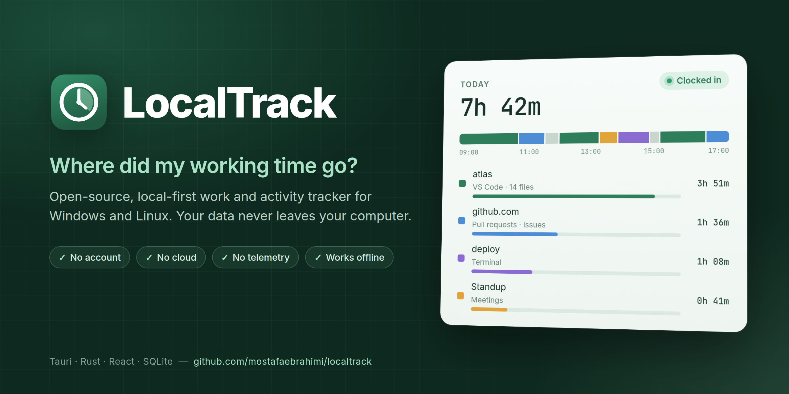
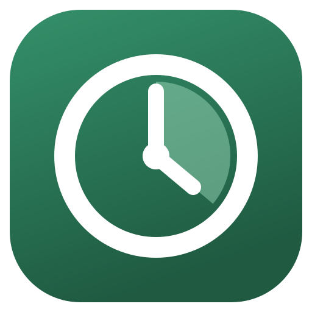

<p align="center">
  
</p>

#  LocalTrack

[](https://github.com/mostafaebrahimi/localtrack/actions/workflows/ci.yml)
[](LICENSE)


**Local-first. No account, no cloud and no telemetry, unless your organization enrolls the
device. In that case every page says so.**

LocalTrack is an open-source work and activity tracker for Windows and Linux.
It answers one question:

> Where did my working time go?

Clock in, work, clock out. LocalTrack records which applications, windows, websites and
pages your time went to, and how much of it was active, idle or on a break. You can
categorize that time, assign it to projects, filter it and export it to Excel or CSV.

Everything stays on your computer. There is no backend, no API, no account, no analytics
and no crash reporting. Disconnect the machine from the internet and every feature still
works.

---

## Contents

- [Features](#features)
- [What it deliberately does not do](#what-it-deliberately-does-not-do)
- [Platform support](#platform-support)
- [Getting started](#getting-started)
- [Connecting a browser](#connecting-a-browser)
- [Where your data lives](#where-your-data-lives)
- [Repository layout](#repository-layout)
- [Development](#development)
- [Documentation](#documentation)
- [Contributing](#contributing)
- [Security](#security)
- [License](#license)

## Features

### Tracking

- Clock in and clock out, with breaks, descriptions and manual corrections
- Time entries for work done away from the computer
- Automatic tracking of the active desktop application and window title. It follows the
  mouse pointer as well as keyboard focus
- Idle (AFK) detection and system lock/unlock. When you stop working, the automatic
  clock-out backdates to the moment you actually stopped
- Chrome **and Firefox** tracking through the official Native Messaging API: active tab,
  domain, page title and sanitized URL
- A **title reader** that turns window titles into what you were actually working on: the
  project open in your editor, the directory or task behind a terminal, the repository or
  ticket behind a page. Your day is reported by project, not just by application

### Reports

- A primary timeline where browser pages replace the generic "Chrome" block, and time is
  never counted twice
- Applications, websites, addresses, categories and projects reports
- Week-by-week totals, broken down into days and into the applications, websites and page
  addresses behind them
- A fresh start every day. The session is split at local midnight, so today always begins
  at zero even if you worked past it
- Honest gaps. Untracked time tells you how much of it was LocalTrack simply not running
- Classification rules with priorities. Manual overrides always win over rules
- XLSX and CSV export

### Desktop experience

- A floating timer bar that snaps to any screen edge and stays there, showing what is being
  tracked
- A system tray icon whose colour shows the current state, with the running time beside it
- Autostart and start minimized
- Interface in English, Spanish, Catalan and Persian
- Light on resources: under 1% of one CPU core while running. When the window is closed to
  the tray, the dashboard's renderer is released completely
  ([resource budget](docs/architecture.md#resource-budget))

### Privacy and data

- URL storage policy, exclusion rules, incognito policy, pause tracking, delete ranges and
  retention limits
- Sanitization and exclusion run **before** anything is written to disk
- SQLite storage with migrations, backup and restore

### Optional employee mode

An organization can enroll a device to receive daily **aggregate** reports, shared
categories and rules, locked settings and two-way timer sync. Enrollment is always visible
to the person being tracked, and page titles, URLs, window titles and notes never leave
the machine. See [docs/managed-mode.md](docs/managed-mode.md).

## What it deliberately does not do

LocalTrack has no:

- keylogging, typed-text capture or clipboard capture
- screenshots or screen recording
- webcam or microphone access
- network interception
- browser history import, cookie access or DOM text harvesting
- productivity score
- stealth mode or remote command channel

Even in employee mode, a server can never start, stop or pause tracking, and it can never
ask for the detail that stays on the machine.

See [PRIVACY.md](PRIVACY.md) for the full privacy statement.

## Platform support

| Platform | Application and window tracking | Idle and lock | Browser tracking |
| --- | --- | --- | --- |
| Windows 10 / 11 | Full (Win32) | Yes | Chrome, Firefox |
| Linux, X11 | Full | Yes | Chrome, Firefox |
| Linux, Wayland | Reduced. What is available is detected and shown in **Diagnostics** | Idle through XWayland when available | Chrome, Firefox |

Wayland has no universal API for reading the foreground window. LocalTrack shows what it
can and cannot see there. It does not guess.

## Getting started

Prebuilt installers will be published on the
[Releases](https://github.com/mostafaebrahimi/localtrack/releases) page. Until then, build
from source.

### Requirements

- Rust 1.77 or newer
- Node 20+ and pnpm 10+
- **Linux only:** GTK 3 and WebKitGTK 4.1 development packages. On Debian or Ubuntu:

  ```bash
  sudo apt install libwebkit2gtk-4.1-dev libgtk-3-dev libsoup-3.0-dev \
    libayatana-appindicator3-dev librsvg2-dev patchelf
  ```

- **Windows:** the Microsoft C++ Build Tools and WebView2. WebView2 ships with Windows 11

### Build and run

```bash
git clone https://github.com/mostafaebrahimi/localtrack.git
cd localtrack
pnpm install

pnpm dev:desktop     # run in development mode
pnpm build:desktop   # build installers
```

`pnpm build:desktop` writes installers to `target/release/bundle/`. On Linux you get
`.deb` and `.AppImage`. On Windows you get an NSIS `.exe` and an `.msi`.

### First run

1. Open LocalTrack and press **Clock in**.
2. Work as usual. The timer bar and tray icon show what is being tracked.
3. Press **Clock out**, or let idle detection end the session for you.
4. Open **Reports** to see where the time went. Add categories, rules and projects to make
   the reports sharper. Export to XLSX or CSV whenever you need to.

## Connecting a browser

Website tracking is optional. Without it, LocalTrack still records the browser window
title.

1. Build the extension:
   - Chrome: `pnpm build:extension`
   - Firefox: `pnpm --filter @localtrack/chrome-extension build:firefox`
2. Load it:
   - **Chrome:** open `chrome://extensions`, enable developer mode, click **Load unpacked**
     and choose `apps/chrome-extension/dist`.
   - **Firefox:** open `about:debugging`, go to **This Firefox**, click **Load Temporary
     Add-on** and choose `apps/chrome-extension/dist-firefox/manifest.json`.
3. Copy the extension id and register the native messaging host:

   ```bash
   # Linux
   scripts/install-native-host.sh <extension-id>

   # Windows (PowerShell)
   powershell -ExecutionPolicy Bypass -File scripts\install-native-host.ps1 <extension-id>
   ```

   These scripts build and run `localtrack-native-host install <extension-id>`. You can
   also run that command yourself.
4. Reload the extension. The popup should show **Connected**.

The host manifest is installed for the current user only. It names exactly that one
extension (`allowed_origins` for Chrome, `allowed_extensions` for Firefox) and never uses
a wildcard. To remove it on Linux, run `scripts/uninstall-native-host.sh`.

## Where your data lives

| Platform | Location |
| --- | --- |
| Linux | `~/.local/share/localtrack/` (or `$XDG_DATA_HOME/localtrack`) |
| Windows | `%APPDATA%\LocalTrack\` |

`localtrack.db` is an ordinary SQLite database that you can open with any SQLite tool.
`logs/` holds rotating operational logs, which never contain URLs, titles or notes. Set
`LOCALTRACK_DATA_DIR` to use a different location.

## Repository layout

```text
apps/
  desktop/            Tauri 2 application: React dashboard + thin Rust shell
  chrome-extension/   Manifest V3 extension for Chrome and Firefox (service worker + React popup)
crates/
  localtrack-core/               domain core: intervals, clock, privacy, classification, aggregation
  localtrack-storage/            SQLite: migrations, repositories, retention, backup
  localtrack-collector-common/   collector interface + the event processing pipeline
  localtrack-collector-linux/    X11 adapter, Wayland capability detection
  localtrack-collector-windows/  Win32 foreground window, idle and lock
  localtrack-export/             XLSX and CSV writers
  localtrack-native-host/        Chrome and Firefox Native Messaging host binary
  localtrack-app/                desktop services: queries, reports, exports, diagnostics
  localtrack-sync/               the only outbound network code, used by employee mode
packages/
  protocol/           shared native messaging types, schemas and URL sanitization
docs/                 architecture, privacy, database, protocol, development
scripts/              native host install, CI checks, icon generation
```

**Tech stack:** Rust, Tauri 2, React 18, TypeScript, TanStack Query, SQLite (rusqlite),
Vite, Vitest.

## Development

```bash
# Rust: everything except the GUI shell, so this works on a headless machine
cargo test
cargo clippy --workspace --all-targets -- -D warnings
cargo fmt --all

# Frontend and extension
pnpm -r typecheck
pnpm -r lint
pnpm -r test

# Everything CI runs, in the order that fails fastest
scripts/check.sh
```

[docs/development.md](docs/development.md) covers environment variables, debugging the
collectors and the extension, where to add new features, the test map and the release
checklist.

## Documentation

| Document | What it covers |
| --- | --- |
| [docs/architecture.md](docs/architecture.md) | Layers, the event pipeline, segments, title reading, threads, resource budget |
| [docs/privacy.md](docs/privacy.md) | What is collected, what is not, and how sanitization works |
| [docs/database.md](docs/database.md) | Schema, tables and migrations |
| [docs/protocol.md](docs/protocol.md) | The extension ↔ native host protocol |
| [docs/managed-mode.md](docs/managed-mode.md) | Employee mode: enrollment, policy and report payloads |
| [docs/development.md](docs/development.md) | Building, testing, debugging and releasing |

## Contributing

Contributions are welcome. Please read [CONTRIBUTING.md](CONTRIBUTING.md) first. It
lists the few hard rules, such as no network by default and no surveillance features,
and the definition of done.

## Security

Please do not report vulnerabilities in public issues. See [SECURITY.md](SECURITY.md)
for how to report one privately, and for the threat model.

## License

[MIT](LICENSE). The bundled Vazirmatn font is licensed under the
[SIL Open Font License](apps/desktop/src/assets/fonts/OFL.txt).
